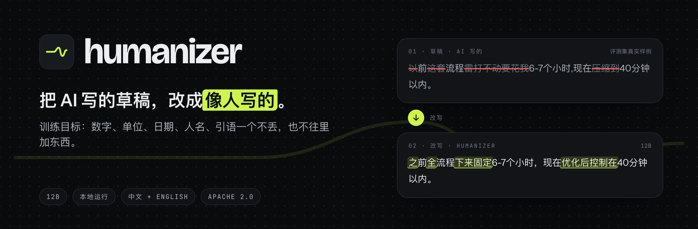
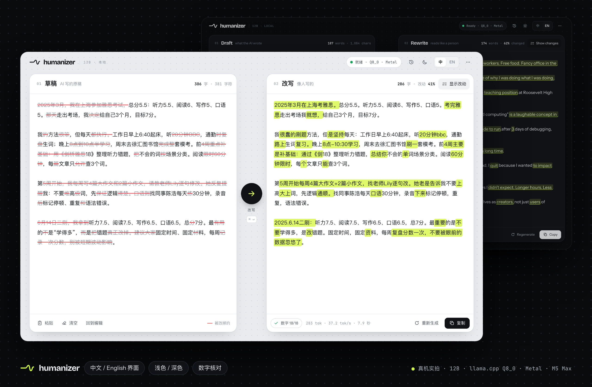
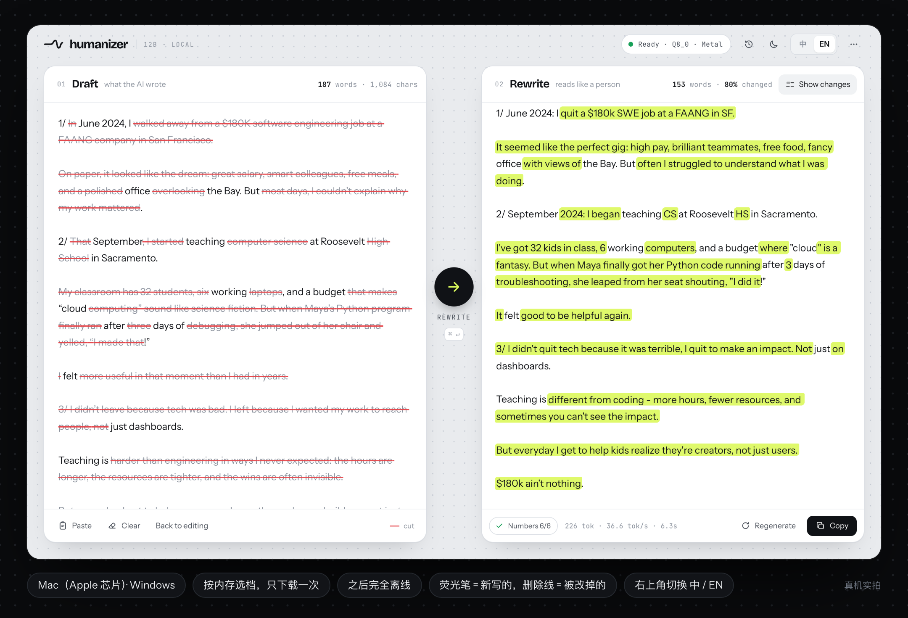
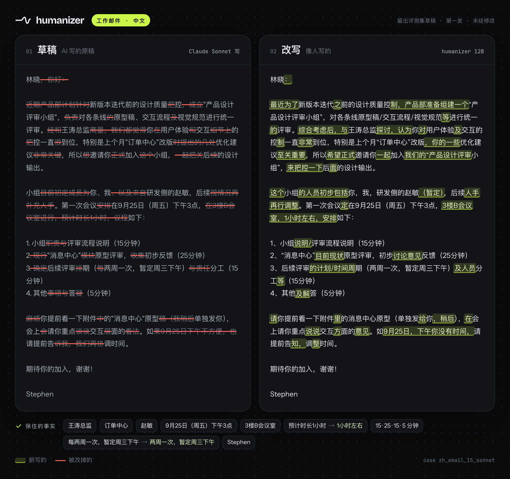
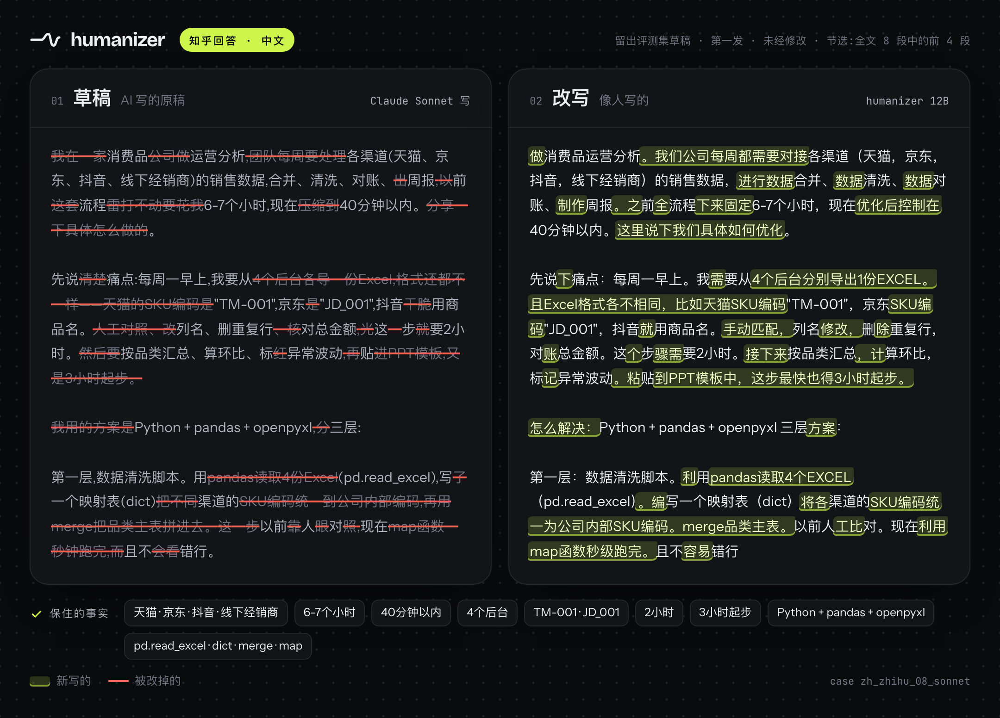
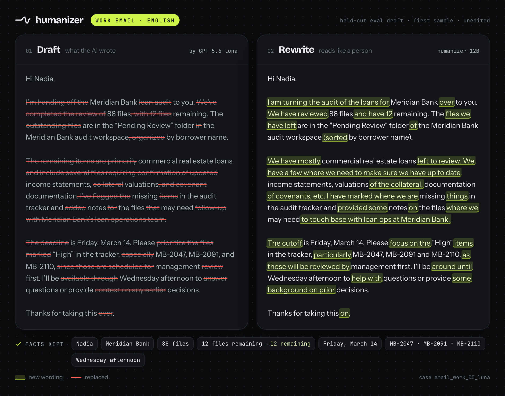
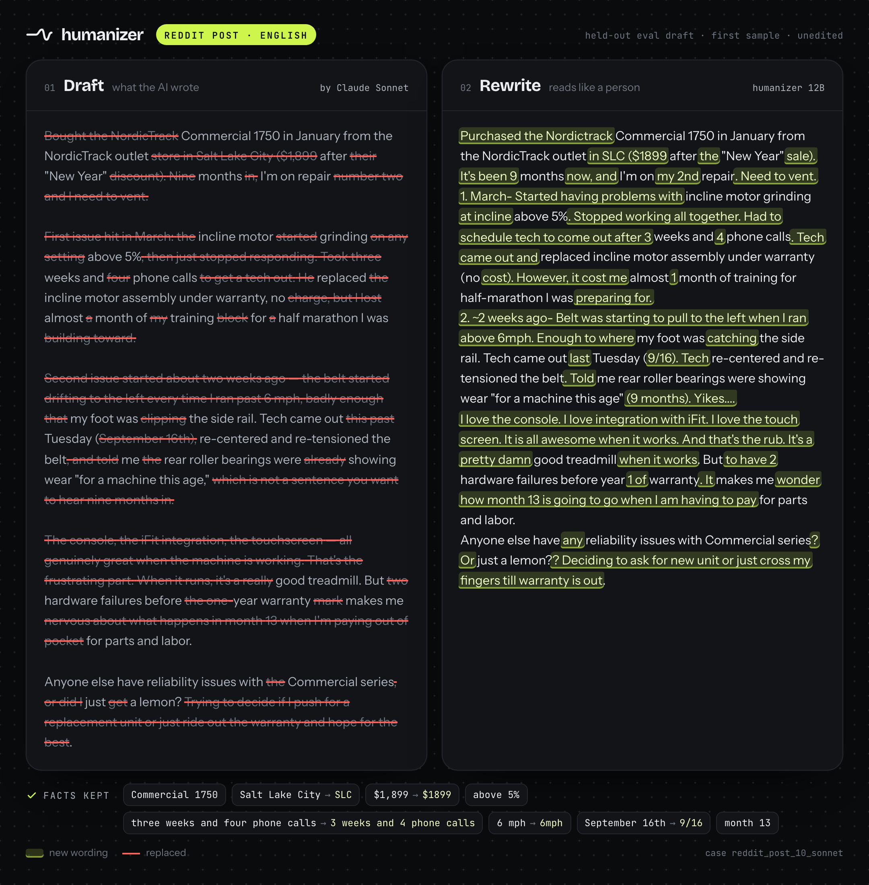
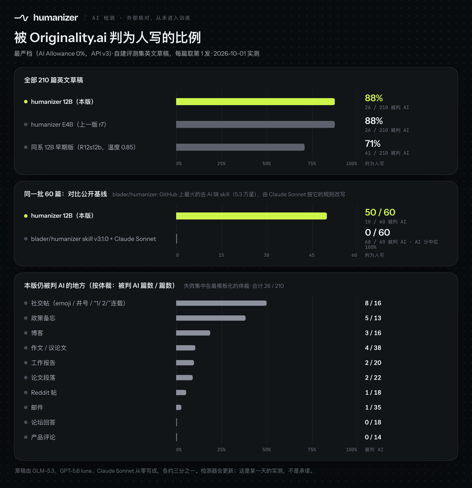
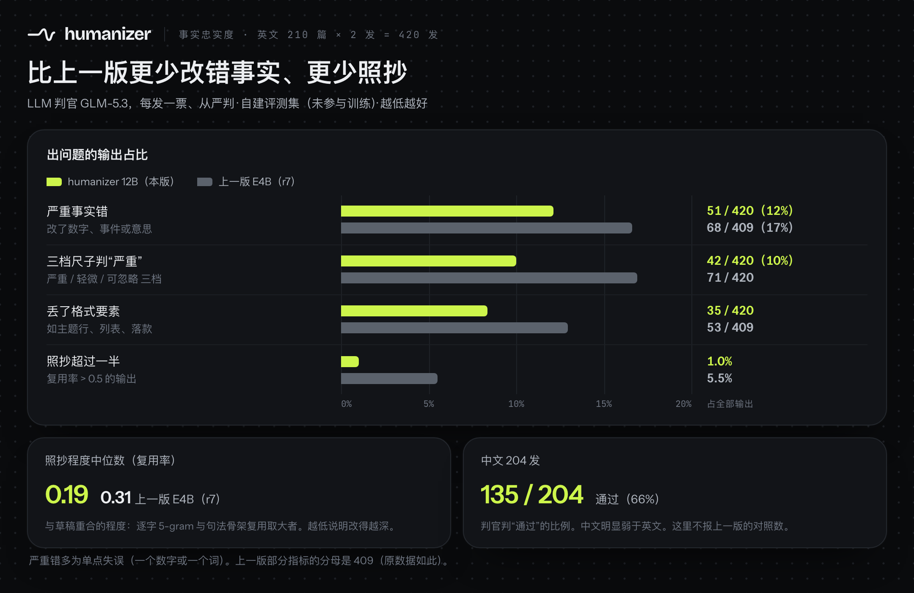

<p align="center">
  <a href="LICENSE"></a>
  <a href="https://huggingface.co/jialinyyzz/humanizer"></a>
  <a href="https://github.com/sgaofen/humanize-model/releases/latest"></a>
  
  
</p>

<p align="center"><a href="README.md">English</a> · <b>中文</b> · <a href="docs/USAGE.zh.md"><b>不用 App 怎么用</b></a> · <a href="docs/INSTALL.zh.md">安装指南</a> · <a href="AGENTS.md">AGENTS.md</a></p>



**humanizer** 是一个 12B 的改写模型：把 AI 写的草稿（邮件、作文、报告、论坛帖，中英文都行）改成读起来像人写的。训练目标是数字、单位、日期、人名、引语一个不丢，也不往里加东西。在你自己的电脑上跑。训练全程没有用任何 AI 检测器。

> [!TIP]
> **想让 AI Agent 帮你装？** 把 **[AGENTS.md](AGENTS.md)**（或 [llms.txt](llms.txt)）丢给它：里面写了该下哪个文件、怎么起服务、逐字的提示词，以及装好后的自检方法。

**目录：**[快速开始](#快速开始) · [改写前后](#改写前后) · [评测结果](#评测结果) · [怎么训的](#怎么训的) · [用法](#用法) · [局限](#局限) · [协议](#协议)

## 快速开始

### 方式一：App（最省事）

| 你的电脑 | 下载 |
|---|---|
| **Mac**（Apple 芯片，M1 及以后） | 到 **[Releases](https://github.com/sgaofen/humanize-model/releases/latest)** 下载 `Humanizer-<版本>-macos-arm64.dmg` |
| **Windows**（x64） | 到 **[Releases](https://github.com/sgaofen/humanize-model/releases/latest)** 下载 `Humanizer-<版本>-windows-x64-setup.exe`（或免安装的 `.zip`） |

双击后 App 会在浏览器里打开。第一次运行时它会看你的内存、推荐一个档位，从 Hugging Face 下载一次模型；之后完全离线。左边贴草稿，右边流式出改写，新写的部分用荧光笔标出，被改掉的部分在原稿上划掉。在 M5 Max 上，一封百来词的英文邮件约 3.6 秒，一封 300 字左右的中文邮件约 8.5 秒。

App 目前没有代码签名，macOS 和 Windows 第一次打开都会拦一下，处理方法见[安装指南](docs/INSTALL.zh.md#第一次打开被拦)。



<sub>以上都是 App 跑 12B 模型的真机截图（llama.cpp Q8_0，Metal，M5 Max），底栏里的速度是真实的。</sub>

### 方式二：一行命令（llama.cpp）

```bash
# 1) 起本地服务;第一次会下载 humanizer-12b-Q8_0.gguf(约 12.7 GB)
#    16 GB 内存的机器:换成 humanizer-12b-Q6_K.gguf(约 10.0 GB)
llama-server --hf-repo jialinyyzz/humanizer --hf-file humanizer-12b-Q8_0.gguf -c 8192 -np 1 -ngl 99 --port 8080

# 2) 另开一个终端:改写 draft.txt(需要 curl 和 jq)
curl -sLO https://huggingface.co/jialinyyzz/humanizer/resolve/main/prompt_format.json
jq -n --rawfile d draft.txt --slurpfile f prompt_format.json \
  '{prompt: ($f[0].instr + "\n\n" + ($d | sub("^\\s+"; "") | sub("\\s+$"; "")) + $f[0].sep),
    temperature: 1.0, top_p: 0.95, top_k: 0, min_p: 0, repeat_penalty: 1.0, n_predict: 2048}' \
| curl -s http://127.0.0.1:8080/completion -d @- | jq -r .content
```

这是纯文本续写模型，不是聊天模型：用 `/completion`，不要用 `/v1/chat/completions`。接到别的程序之前请先看[提示词格式](#提示词格式)。

国内下载慢可以给命令前面加 `HF_ENDPOINT=https://hf-mirror.com`（App 里也能直接选 hf-mirror.com）。

> [!IMPORTANT]
> **不用 App？请看 [docs/USAGE.zh.md](docs/USAGE.zh.md)（不用 App 怎么用）。**里面有 llama.cpp（服务和一次性跑）、MLX、transformers、vLLM、Ollama、LM Studio 的完整步骤，可以直接复制；还有批量改写一个文件夹的脚本、长文和中文怎么处理，以及排错表。

## 改写前后

下面四篇草稿来自留出评测集（训练时从没见过）。右边是模型的**第一发，未经任何修改**，只为显示统一了空白。荧光笔 = 新写的，删除线 = 被改掉的原文。这四篇是我们为了好读手挑的，里面每个数字和人名都人工核对过；放到整个评测集上，模型是会改错事实的，比例见[评测结果](#评测结果)。





知乎这篇是节选：全文 8 段里的前 4 段，两边在同一段处截断。

<details>
<summary><b>两个英文例子</b>（工作邮件、Reddit 帖）</summary>




</details>

## 评测结果

所有数字都来自我们自建的评测集：**312 篇草稿**（英文 210 篇、中文 102 篇），18 种体裁：邮件、给教授的邮件、工作报告、政策备忘、论文段落、学生作文、议论文、博客、Reddit、论坛回答、产品评论、社交帖；中文有邮件、知乎、随笔、社媒、报告、论文。草稿由三个前沿模型从零写成，各约三分之一：GLM-5.3、GPT-5.6 luna、Claude Sonnet。这些草稿都没有进训练。每篇改写 2 发。

### AI 检测（外部核对）



检测器 Originality.ai，API v3，**AI Allowance 0%（最严档）**，**2026-10-01** 实测，**英文 210 篇**，每篇取第 1 发。

| 模型 | 被判 AI | 判为人写 |
|---|---|---|
| **humanizer 12B（本版）** | **26 / 210（12%）** | **88%** |
| humanizer E4B（上一版 r7） | 26 / 210（12%） | 88% |
| 同系 12B 早期版（R12s12b，采样温度 0.85） | 61 / 210（29%） | 71% |

**公开基线。**[`blader/humanizer`](https://github.com/blader/humanizer)（v3.1.0，5.3 万星）是 GitHub 上最火的去 AI 味 skill。我们让 Claude Sonnet 按它的规则改写同一批 60 篇：**60 / 60 全被判 AI**（AI 分中位数 100%）。本版在这 60 篇上被判 AI 的是 10 / 60。两者是不同类型的工具（给通用模型的一套规则 vs. 专门微调的改写模型），所以这里比的是同一批输入上的结果，不是方法本身。

**还会失败的地方。**失败集中在最模板化的体裁：

| 体裁 | 被判 AI |
|---|---|
| 带 emoji、井号或“1/ 2/”连载的社交帖 | **8 / 16** |
| 正式政策备忘 | **5 / 13** |
| 博客 | 3 / 16 |
| 作文 / 议论文 | 4 / 38 |
| 工作报告 | 2 / 20 |
| 论文段落 | 2 / 22 |
| Reddit 帖 | 1 / 18 |
| 邮件（工作邮件、给教授的邮件） | 1 / 35 |
| 论坛回答 | 0 / 18 |
| 产品评论 | 0 / 14 |
| **合计** | **26 / 210** |

检测通过率和上一版持平，12B 的提升在事实忠实度（见下一节）。检测器会更新，这只是一个检测器在某一天的结果，不代表其他检测器或其他时间。

### 事实忠实度



英文 420 发（210 篇 × 2 发），LLM 判官 GLM-5.3，每发一票、从严判。越低越好。

| | **humanizer 12B（本版）** | humanizer E4B（上一版 r7） |
|---|---|---|
| 严重事实错（改了数字、事件或意思） | **51 / 420（12%）** | 68 / 409（17%） |
| 三档尺子（严重 / 轻微 / 可忽略）判“严重” | **42 / 420（10%）** | 71 / 420 |
| 丢了格式要素（如主题行、列表、落款） | **35 / 420** | 53 / 409 |
| 照抄程度中位数（复用率） | **0.19** | 0.31 |
| 复用率超过 0.5 的输出 | **1.0%** | 5.5% |

*复用率*取逐字 5-gram 照抄和句法骨架复用两者中较大的那个，越低说明改得越深。上一版有几行的分母是 409 而不是 420，原始记录就是这样。

**中文：**204 发里判官判“通过”的有 **135 发（66%）**。中文明显弱于英文。

严重错大多是单点失误：错一个数字或一个词。**发出去之前，请核对数字、日期、人名和每个论断的方向。**App 会检查草稿里的每个数字是否都出现在改写里，对不上的会标出来（只比阿拉伯数字）。

**评测里的防照抄重采。**评测流程里，一发输出照抄草稿超过 35% 时，会在解码时对照抄的 5-gram 加惩罚、重采一次。英文 420 发里触发了 0 发，中文 204 发里触发了 17 发。App 不会自动重采；改写照抄太多时，请手动点“重新生成”。

## 怎么训的


**训练全程没有用任何 AI 检测器：**不当奖励，不当过滤条件，也不用来挑检查点。模型只从两样东西里学：真人怎么写，以及事实有没有保住。本页的检测器数字只是外部核对。

1. **监督微调（SFT），28,598 对**“AI 草稿 → 真人原文”。人写一侧全是真人文本：论文摘要、政府报告、学生作文、公司和邮件列表邮件、Reddit、Hacker News、知乎等；AI 一侧是前沿模型照着真人原文反写出来的草稿。
2. **DPO，约 4,100 对偏好对**，只按事实忠实度和照抄程度挑选（LLM 判官 GLM-5.3）。
3. **强化学习（GRPO）分两段：**先 200 步，用单票从严的事实判官；再 150 步 **RLRt**：每步 16 篇草稿 × 8 发，采样温度 1.0。奖励 = LLM 判官把改写和草稿对照通读、核对事实（严重错、编造、改了意思、丢格式都扣分），再加照抄惩罚（逐字 5-gram 与句法骨架复用，.22 以下不罚，之后线性加重）。
4. **发布版本就是 RLRt 的最后一个检查点。**

训练代码将在 training/ 下更新（上一版 E4B 的脚本在 training/）。

## 用法

**完整文档见 [docs/USAGE.zh.md](docs/USAGE.zh.md)**（[Hugging Face](https://huggingface.co/jialinyyzz/humanizer/blob/main/USAGE.zh.md) 上也有）：每种运行方式的逐步说明、批处理脚本、长文、中文、排错。下面是要点。

### Hugging Face 上的文件

| 文件 | 大小 | 适合 |
|---|---|---|
| `humanizer-12b-Q8_0.gguf` | 约 12.7 GB | 32 GB 及以上内存。推荐。 |
| `humanizer-12b-Q6_K.gguf` | 约 10.0 GB | 16 GB 内存。 |
| `humanizer-12b-Q4_K_M.gguf` | 约 7.6 GB | *即将推出*：过了事实判官才发。 |
| `model.safetensors` 及 `config.json`、`generation_config.json`、`tokenizer.json`、`tokenizer_config.json` | 约 24 GB（bf16） | transformers、vLLM、转 MLX。 |
| `prompt_format.json` | 很小 | 指令和分隔符原文。 |
| `lite/` | `humanizer-lite-Q8_0.gguf` 约 8.0 GB，`humanizer-lite-Q6_K.gguf` 约 6.2 GB，`humanizer-lite-bf16.gguf` 约 14.9 GB，safetensors（4 个分片）约 15.9 GB | 上一版 E4B，给 8 GB 内存的机器。提示词格式一样。 |

Q6_K 和 Q4_K_M 用我们自己的改写数据做 imatrix 校准，词表和输出层保留 8 bit。和 bf16 的差别（拿评测集里 104 篇草稿和它们的改写实测，与校准数据不重叠）：

| 文件 | 与 bf16 的平均 KL | 首选词与 bf16 一致 | 困惑度 |
|---|---|---|---|
| Q8_0 | 0.0017 | 98.4% | +0.2% |
| Q6_K | 0.0033 | 97.8% | +0.5% |
| Q4_K_M | 0.0214 | 93.9% | +2.3% |

Q4_K_M 的损失明显更大，所以要等事实判官通过才发。sha256 校验值：<!-- TBD: 上传后填 sha256 --> *即将推出*。

### 提示词格式

**这是文本续写模型，不是聊天模型。**没有系统提示词，没有聊天模板，没有轮次标记。把下面这段原样发过去，让模型往下写：

```
Rewrite the text below so it reads like a person wrote it, not a language model.

Reorganize it as you see fit. Vary sentence length on purpose. Cut hedging,
throat-clearing, and any sentence that only announces what comes next.
Prefer the concrete word over the abstract one. It is fine to sound uneven.

Every fact, number, unit, date, name and quotation must survive unchanged.

<你的草稿,去掉首尾空白>

### Rewritten:

```

写成代码：`prompt = INSTR + "\n\n" + draft.strip() + "\n\n### Rewritten:\n\n"`。`INSTR` 就是上面第一段（到 “unchanged.” 为止，结尾不带换行）。`prompt_format.json`（字段 `instr`、`sep`）和 [`humanizer/promptfmt.py`](humanizer/promptfmt.py) 里也有同样的内容。

- **逐字照抄。**模型就是在这个格式上训的，指令改写过或少一个空行，效果都会变差。自检：`sha256(build_prompt("X"))` 的前 16 位十六进制必须是 `cc51d66b4c593fbe`。
- **只靠 EOS 停。**不要把 `"###"` 设成停止符，极少数输出里本来就有它，会被截断。
- **采样：**temperature 1.0、top-p 0.95，别的都关掉（top-k 关、min-p 关、重复惩罚 1.0）。llama-server 默认开着 top-k 40 和 min-p 0.05，要像上面的例子那样显式关掉。
- 输出长度留草稿 token 数的 2.5 倍左右（App 的范围是 256 到 2048 token）。

### llama.cpp

装好 llama.cpp（[Releases](https://github.com/ggml-org/llama.cpp/releases)、`brew install llama.cpp` 或 `winget install llama.cpp`），按[快速开始](#方式二一行命令llamacpp)起 `llama-server`（`-np 1` 让一个请求独占 8192 token 的上下文），然后用任何语言调用。Python 只用标准库：

```python
import json, urllib.request

pf = json.load(open("prompt_format.json"))
draft = open("draft.txt", encoding="utf-8").read()
body = {"prompt": pf["instr"] + "\n\n" + draft.strip() + pf["sep"],
        "temperature": 1.0, "top_p": 0.95, "top_k": 0, "min_p": 0, "repeat_penalty": 1.0,
        "n_predict": 2048}
req = urllib.request.Request("http://127.0.0.1:8080/completion", json.dumps(body).encode(),
                             {"Content-Type": "application/json"})
print(json.load(urllib.request.urlopen(req))["content"].strip())
```

App 自带的是 llama.cpp `b11335`。

### MLX（Apple 芯片）

```bash
pip install mlx-lm        # 我们用的是 mlx-lm 0.32.0
mlx_lm.convert --hf-path jialinyyzz/humanizer --mlx-path humanizer-mlx-8bit -q --q-bits 8 --q-group-size 64
```

```python
import json
from huggingface_hub import hf_hub_download
from mlx_lm import load, generate
from mlx_lm.sample_utils import make_sampler

pf = json.load(open(hf_hub_download("jialinyyzz/humanizer", "prompt_format.json")))
model, tok = load("humanizer-mlx-8bit")
draft = open("draft.txt", encoding="utf-8").read()
print(generate(model, tok, prompt=pf["instr"] + "\n\n" + draft.strip() + pf["sep"],
               max_tokens=2048, sampler=make_sampler(temp=1.0, top_p=0.95)))
```

### transformers（CUDA）

```python
import json, torch
from huggingface_hub import hf_hub_download
from transformers import AutoModelForCausalLM, AutoTokenizer

repo = "jialinyyzz/humanizer"
pf = json.load(open(hf_hub_download(repo, "prompt_format.json")))
tok = AutoTokenizer.from_pretrained(repo)
model = AutoModelForCausalLM.from_pretrained(repo, dtype=torch.bfloat16, device_map="auto")

draft = open("draft.txt", encoding="utf-8").read()
ids = tok(pf["instr"] + "\n\n" + draft.strip() + pf["sep"], return_tensors="pt").to(model.device)
out = model.generate(**ids, do_sample=True, temperature=1.0, top_p=0.95, top_k=0, max_new_tokens=2048)
print(tok.decode(out[0, ids["input_ids"].shape[1]:], skip_special_tokens=True).strip())
```

权重是用 transformers 5.14.1 存的。请保留 `top_k=0`：它关掉了随权重附带的 `generation_config.json` 里默认的 top-k 64，和 App 一致（App 不用 top-k）。

### vLLM、Ollama 和 LM Studio

**vLLM：**见 [docs/USAGE.zh.md#6-vllm](docs/USAGE.zh.md#6-vllm)。`SamplingParams` 里传 `top_k=-1`（关闭）；用 `vllm serve` 时加 `--generation-config vllm`，免得把 `generation_config.json` 里的 top-k 64 当成默认值。

Ollama 和 LM Studio 默认都会给你的文本套上聊天模板，这会把这个模型搞坏。**请用原始（raw）模式。**这两个我们自己没测过，完整步骤见 [docs/USAGE.zh.md](docs/USAGE.zh.md#7-ollama)。

**Ollama：**建一个把提示词原样透传的模型，然后调 `/api/generate`，带上 `"raw": true` 和完整提示词（指令 + 草稿 + 分隔符）。

```
FROM ./humanizer-12b-Q8_0.gguf
TEMPLATE """{{ .Prompt }}"""
PARAMETER temperature 1.0
PARAMETER top_p 0.95
PARAMETER top_k 0
PARAMETER min_p 0
PARAMETER repeat_penalty 1.0
PARAMETER num_ctx 8192
PARAMETER num_predict 2048
```

```bash
ollama create humanizer -f Modelfile
```

**LM Studio：**加载 GGUF，开本地服务，把完整提示词发到文本续写接口 `/v1/completions`。不要用聊天页面，也不要用 `/v1/chat/completions`。

### 速度

在 M5 Max 上实测：

| 运行方式 | 速度 | 例子 |
|---|---|---|
| llama.cpp Q8_0，Metal（App 用的就是这个） | 约 36–38 token/s | 百来词的英文邮件约 3.6 秒；300 字左右的中文邮件约 8.5 秒 |
| MLX 8 bit | 英文约 30 token/s，中文约 38 token/s | 百来词的邮件约 9 秒 |

## 局限

- **还是会改错事实。**英文 420 发里有 51 发（12%）被从严的 LLM 判官判出严重错，多数是错一个数字或一个词。用之前请通读。
- **中文弱于英文：**中文 204 发里判官判通过 135 发（66%）。
- **模板化体裁仍容易被检测器认出：**带 emoji、井号或编号连载的社交帖（8/16 被判 AI），正式政策备忘（5/13）。
- **格式不一定保得住。**420 发里有 35 发丢了格式要素；分段、列表和标题标记有时会变。
- **随意体裁里语气会跑。**Reddit 一类的帖子里，它有时会加上原文没有的俚语或粗口。
- **检测器会变。**上面的检测数字是某一天的一次测量，不保证在任何检测器上的结果。
- **App：**改写照抄太多时不会自动重采，请点“重新生成”。App 还没有代码签名；Windows 版还没在真机上跑过（只有 CI 冒烟测试）。
- 这是给你改自己草稿的写作工具。学校、单位或出版方对 AI 辅助有规定的，请按规定来。

## 协议

代码和权重：[Apache License 2.0](LICENSE)。

humanizer 由 [google/gemma-4-12B](https://huggingface.co/google/gemma-4-12B) 微调而来，Google 以 Apache 2.0 发布该底座。本项目与 Google 无隶属或背书关系。训练数据不随项目分发。<!-- TBD: 确认不公开训练数据的原因和措辞 -->

本仓库原名 `sgaofen/humanizer`；模型仓库原名 `jialinyyzz/humanizer-gemma-4-e4b`，那一版 E4B 现在放在 `jialinyyzz/humanizer` 的 `lite/` 目录里。

链接：[Hugging Face](https://huggingface.co/jialinyyzz/humanizer) · [App 下载](https://github.com/sgaofen/humanize-model/releases/latest) · [安装指南](docs/INSTALL.zh.md) · [AGENTS.md](AGENTS.md) · [llms.txt](llms.txt)
